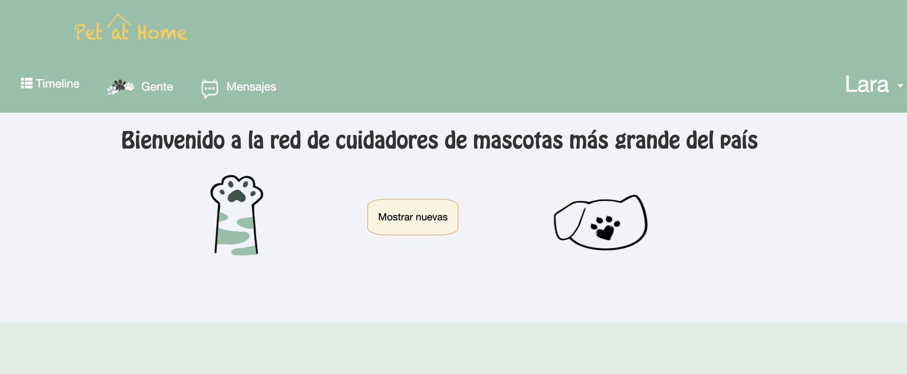
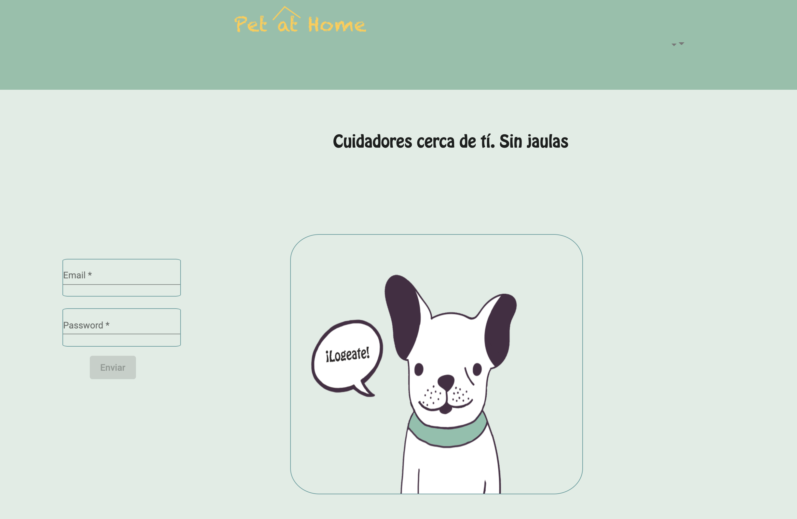
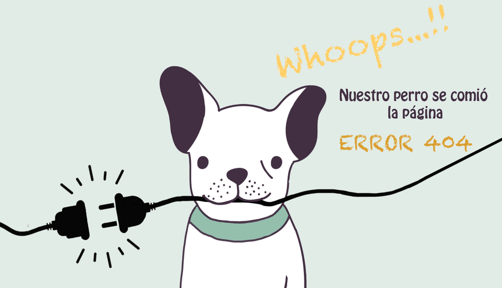

# PetAtHome
"Pet at Home" es una red Social creada con MEAN (MongoDb, Express, Angular, NodeJs).
En ella, sus usuarios provienen de una APP en la que se inscriben tanto para cuidar las mascotas de otrxs cuando
se van de vacaciones, como para buscar cuidadores.

Esta red social se centra en que los usuarios puedan subir fotos y textos de los animales que están cuidando en ese momento, para que sus dueños se queden más tranquilos y para que otros usuarios vean la calidad como cuidadores de cada unx.

# Como instalarla

1. git clone https://github.com/JessicagaRojas/PetAtHome.git

2. Colócate en la carpeta del backend, instálalo y arráncalo.
    -cd backend
    -npm install
    -npm start

3. Colócate en la carpeta del frontend, instálalo y arráncalo.
    -cd pahfrontend
    -npm install
    -ng serve --open 

### Vista Principal

 

### Vista del Login

 

### Vista de la página de error

